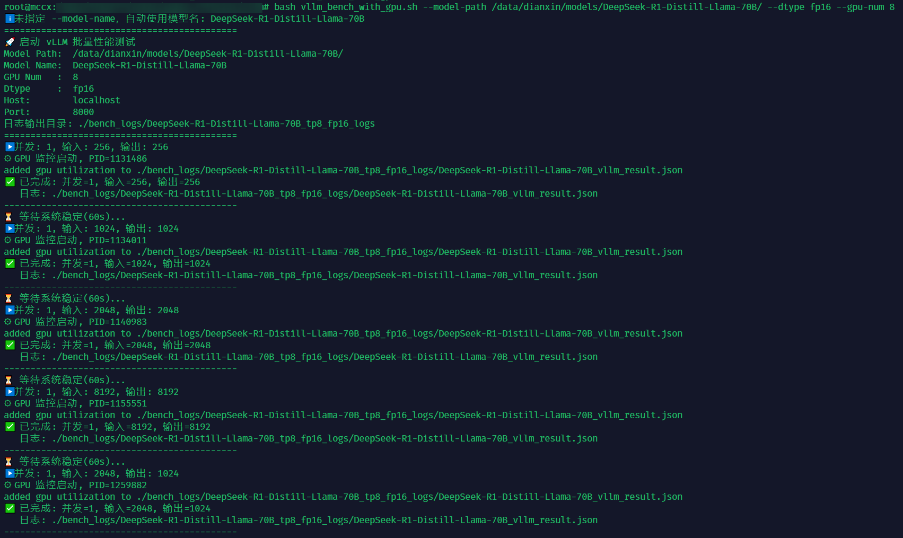
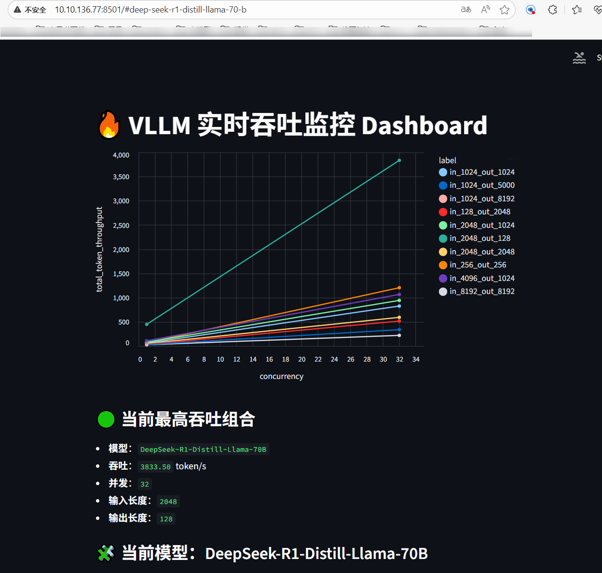

# 1. 起服务
（略）假设已通过vllm serve 启动 serve 服务：
- model: /data/model/Qwen3-32B
- served-model-name: Qwen3-32B
- tp: 8
- dtype: bfloat16


# 2. 单次 bench 测试
```shell
bash vllm_bench.sh \
    --model-path /data/model/Qwen3-32B \
    --model-name Qwen3-32B \
    --max-concurrency 32 \
    --input-len 1024 \
    --output-len 1024

# more
bash vllm_bench.sh -h
```

# 3. 批量测试
```shell

bash vllm_bench_with_gpu.sh \
    --model-path /data/model/Qwen3-32B \
    --dtype fp16 \
    --gpu-num 8
```
- gpu-num 和 dtype： 自动生成./bench_logs/Qwen3-32B_tp8_dtypefp16_< time > 目录；另外脚本自动检测每个测试组合对应GPU信息，如利用率，显存占用以及温度等信息，gpu-num 用于指定前 N 张卡用来监控
- vllm_bench_with_gpu.sh：72 ~ 100 行可配置测试并发数以及输入输出组合！


  
## 3.1 log 解析
log 自动保存在./bench_logs/Qwen3-32B_tp8_dtypefp16_< time > 目录：
- Qwen3-32B_vllm_result.json 保存每个测试的结果（已自动拼接 GPU util 等相关信息）,保存形式参看[result.json](realtime_bench_plot/test_log.json)
- gpu_utilization_c<并发数>_in<输入>_out<输出> ：目录保存测试项对应GPU相关信息，包含显存占用，GPU利用率，以及温度
- client_log：目录保存各测试组合对应 vllm serve bench 日志

## 3.2 实时解析
可实时监控各测试项性能，用于探索性能。
```shell
pip install streamlit

streamlit run realtime_bench_plot/realtime_bench_plot.py -- \
    --json-file ./bench_logs/Qwen3-32B_tp8_dtypefp16_< time >/Qwen3-32B_vllm_result.json \
    --metadata tp=8 dtype=fp16
```
